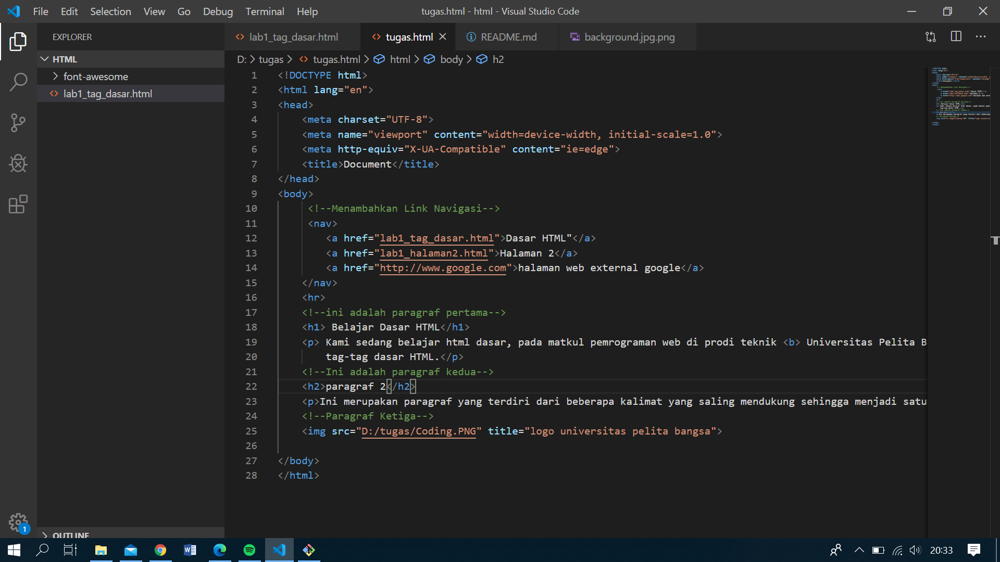

# Tugaslab1
## blajar menggunakan tag dasar
Macam-Macam Tag HTML Beserta Fungsinya – Bagi yang pemula untuk belajar HTML ini dapat dikatakan mudah juga dapat dikatakan sulit. Sebelum kita belajar secara mendalam tentang HTML maka kita harus mengerti terlebih dahulu apa itu HTML dan fungsinya apa saja. HTML yaitu unsur dasar untuk membangun pondasi atau membuat sebuah website. Tidak hanya bangunan seperti rumah gedung ataupun sekolah, dalam web juga memerlukan pondasi yang kuat, karena dalam website yang sering kita kunjungi tersebut terbuat dari kumpulan Bahasa HTML.

contoh tag dasar html

<html> : tag untuk membuat dokumen HTML.
<head> : kepala dari dokumen HTML.
<title> : tag yang berguna untuk membuat judul dari sebuah halaman.
<body> : tag yang digunakan untuk menampilkan isi dokumen HTML.

 : tag untuk membuat paragraph.
<H2> : header 2, sub judul sebuah web.

 : tag yang berfungsi untuk menampilkan teks dengan posisi yang horizontal di tengah.

 : tag yang berguna untuk membuat suatu garis horizontal.
<width> : untuk mengatur suatu Panjang garis pada satuan pixel.

